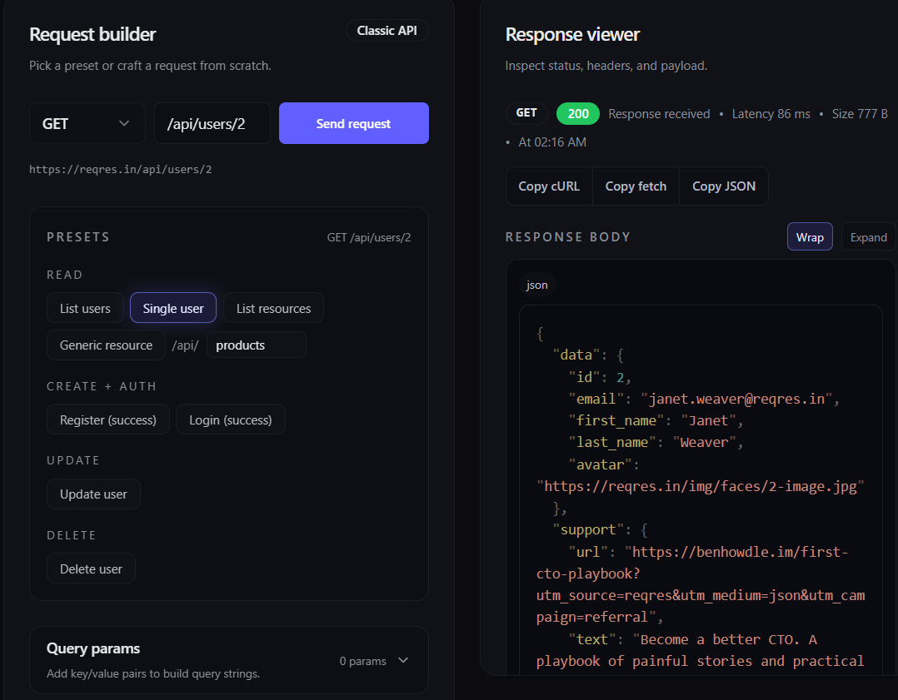
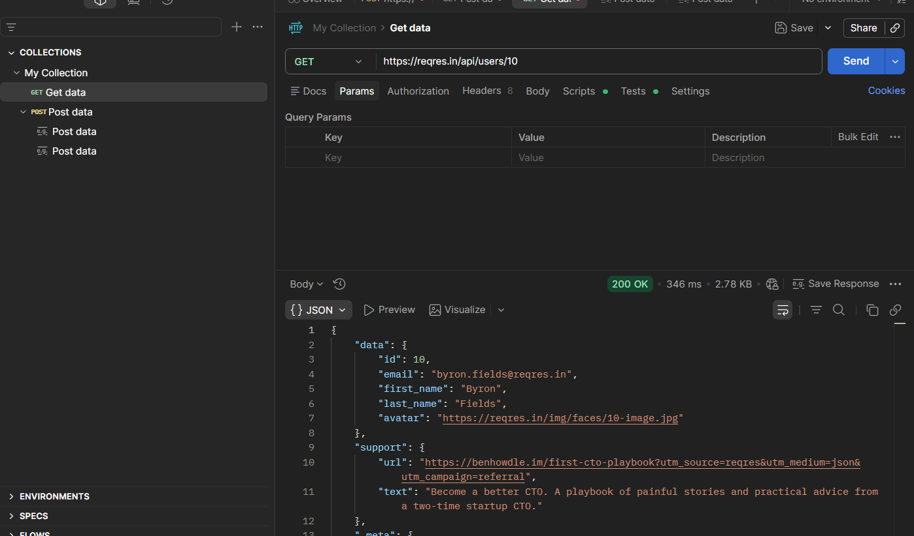
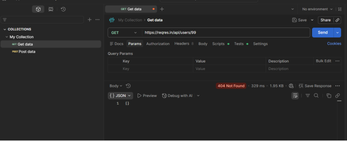
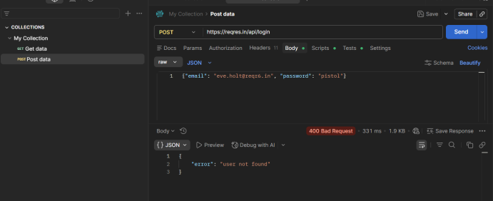
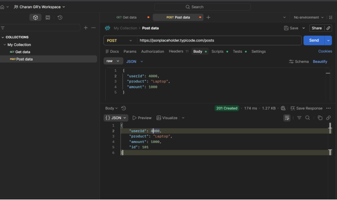

---

# API Manual Simulation – Flow-Based Validation

## Overview

The system was analyzed by breaking it into individual service flows and validating how each behaves independently as well as in combination. Since the services are not actually integrated, the validation focused on simulating real-world behavior by treating them as a single system and verifying consistency manually.

The testing was performed using Postman for API simulation, along with public APIs such as ReqRes for user data, JSONPlaceholder for order data, and a GraphQL API for external data enrichment. This setup helped in replicating a distributed system environment.

---

## User Service Flow (ReqRes API)

The user service was validated using the ReqRes API to understand how user data is retrieved and created.

Fetching valid users returns a proper response with expected structure, confirming that the API works correctly under normal conditions. When invalid user IDs are used, the system returns a not found response, which aligns with expected behavior.

However, issues were observed during user creation. The POST API accepts requests even when the input is incomplete or incorrect. It allows invalid data types and does not enforce required fields. The response returned after creation is also inconsistent, as it does not include the full user structure seen in GET responses.

Repeated POST requests with the same payload result in multiple users being created with different IDs. This confirms that idempotency is not implemented and duplicate data creation is allowed.

Overall, the user service behaves correctly for basic retrieval but lacks strict validation and consistency during data creation.

---

## Order Service Flow (JSONPlaceholder API)

The order service was tested using the JSONPlaceholder API to simulate order creation and retrieval.

Orders are created and fetched using a userId field, which is assumed to represent a valid user. However, the system does not validate whether the provided userId actually exists in the user service.

This leads to a critical issue where orders can be created for non-existent users. The service operates independently and accepts any userId without enforcing relationships, resulting in potential data inconsistencies.

The order service assumes correctness of input rather than validating it, which makes it unreliable in a distributed system context.

---

## External Data Flow (GraphQL API)

The GraphQL API was used to simulate external data enrichment, such as fetching country-related information.

Queries return structured and reliable data under normal conditions. However, this service is treated as always available, and no fallback or failure handling is enforced when the service is slow or unavailable.

This introduces a dependency risk, as failures in external services are not handled and can affect overall system behavior.

---

## End-to-End Flow (User → Order → External Data)

An end-to-end flow was simulated by creating or fetching a user from the user service, linking that user to an order using the order service, and enriching the data using the GraphQL API.

Since these services are not actually connected, consistency was verified manually by mapping order.userId with user.id. For sampled cases, valid mappings were observed, but this consistency is not guaranteed because no service enforces it.

The system allows the flow to complete even when the underlying data is incorrect. For example, an order linked to a non-existent user still results in a successful response. This highlights a major gap where the system does not validate relationships across services.

---

## Observations Across Flows

Across all flows, it was observed that the system is highly permissive. APIs accept invalid inputs, allow duplicate data creation, and do not enforce relationships between entities.

Error handling is weak, as incorrect inputs often still return successful responses. Data type validation is not enforced, and inconsistent data structures are accepted without rejection.

A key observation is that the system does not fail when it should. Instead of rejecting invalid scenarios, it silently accepts them, which can lead to hidden data inconsistencies.

---

## Conclusion

The flow-based validation shows that while each service works independently, there is no enforcement of consistency or validation across the system. The lack of idempotency, input validation, and relationship checks makes the system prone to data inconsistencies.

This manual simulation highlights how distributed systems can appear functional while still producing incorrect or unreliable data, emphasizing the importance of validation beyond individual service testing.

---

few samples of findings :-

## 404 not found for invlaid user id 

## with inalvid credntails 

## Order service allows creation of orders for non-existent users

