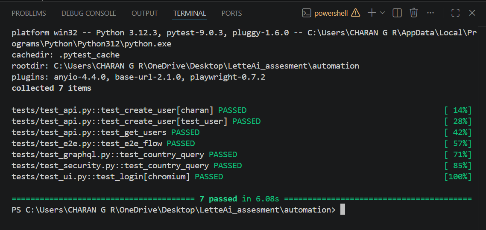

---

## Automation Framework Overview

The automation framework is designed to validate a distributed system by simulating real-world interactions across UI, APIs, and external services. The primary focus is on end-to-end behavior, ensuring that data flows correctly across independent components.

A lightweight and modular structure is used to keep the framework scalable and easy to extend. UI interactions are abstracted using the Page Object Model, while API communication is handled through a reusable client layer to maintain consistency and reduce duplication.

---

## What Was Implemented

UI automation validates the login flow to ensure correct user interaction and response handling.

API automation covers user creation, retrieval, and order simulation. These tests validate backend functionality and ensure APIs behave correctly under different inputs.

An end-to-end workflow is implemented where a user is created, mapped to an order, and enriched with external data. This validates cross-service data flow and highlights integration-level issues.

GraphQL queries are tested to ensure reliable data fetching from external systems.

---

## Data Validation

A dedicated validation layer verifies data integrity across services. It identifies orphan records, mismatched relationships, and incorrect values between entities.

This ensures that even when APIs return successful responses, the underlying data remains consistent and reliable.

---

## Failure Handling in Automation

The framework includes retry logic to handle transient failures, improving test stability in distributed environments.

Tests are designed to simulate failure scenarios such as missing data, invalid inputs, and partial service breakdowns to observe system behavior under stress.

---

## Security Checks in Automation

Basic security validations are performed by testing unauthenticated access and sending manipulated payloads.

This helps identify gaps in access control and input validation, which are critical in real-world systems.

---

## Overall Outcome

The automation framework successfully validates end-to-end system behavior, detects data inconsistencies, and uncovers gaps in validation, resilience, and security.

It demonstrates a practical understanding of how distributed systems behave under both normal and failure conditions, with a strong focus on real-world testing scenarios.

---

