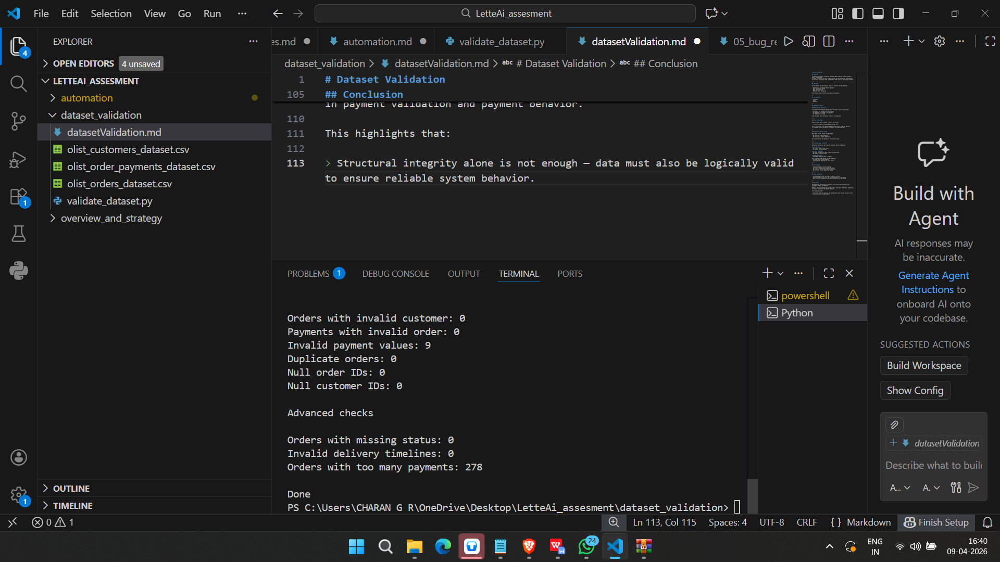

# Dataset Validation

## Objective

The dataset validation focuses on verifying data integrity across Customers, Orders, and Payments.  
The goal is not only to check if data exists, but to ensure that relationships are correct, values are valid, and the data makes sense in real-world scenarios.

---

## Approach

The validation was performed in layers to simulate real QA thinking:

- Relationship validation between datasets  
- Data correctness checks  
- Edge case detection  
- Business logic validation  

This ensures both structural and logical consistency.

---

## Datasets Used

- Customers  
- Orders  
- Payments  

---

## Validation Summary

### Relationship Validation

The relationships between datasets were verified to ensure consistency.

- All orders are linked to valid customers  
- All payments are linked to valid orders  
- No orphan records found  

This indicates that referential integrity is maintained.

---

### Data Correctness

Payment values were validated to ensure correctness.

- 9 records found with invalid payment values (≤ 0)  

This is a critical issue because payment values should always be positive.  
It indicates missing validation at the data or processing layer.

---

### Duplicate and Null Checks

Basic data quality checks were performed.

- No duplicate orders detected  
- No null values in key identifiers  

This confirms that the dataset is structurally clean.

---

### Business Logic Validation

Additional checks were performed to validate real-world behavior.

**Order Status**
- All orders have a valid status  
- No missing values detected  

**Delivery Timeline**
- Verified that delivery date is after purchase date  
- No invalid timelines found  

**Payment Patterns**
- 278 orders have more than 3 payments  

This is unusual and requires further analysis:
- could be valid (split payments)  
- could indicate duplicate or retry issues  

---

## Key Findings

- 9 invalid payment records detected  
- 278 orders show abnormal payment patterns  
- No issues in relationships between datasets  
- No duplicate or null identifier issues  

---

## Risks Identified

- Invalid payment values can impact financial accuracy  
- Multiple payments per order may indicate duplicate transactions  
- Lack of strict validation allows incorrect data into the system  

---

## Conclusion

The dataset is structurally consistent, with strong relationships across Customers, Orders, and Payments.

However, data correctness and business logic issues were identified, especially in payment validation and payment behavior.

This highlights that:

> Structural integrity alone is not enough — data must also be logically valid to ensure reliable system behavior.

