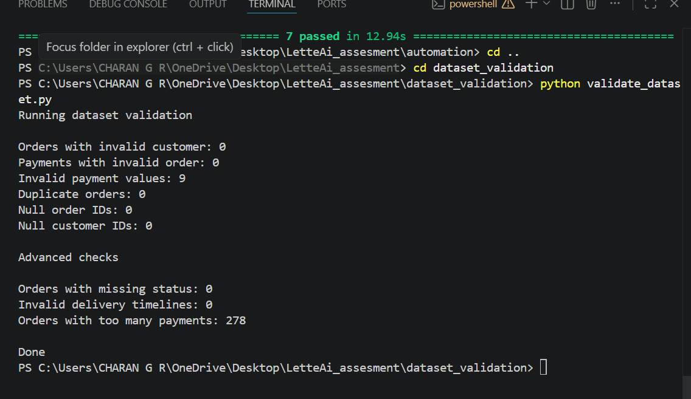

---

# Dataset Validation

## Objective

The dataset validation focuses on verifying data integrity across Customers, Orders, and Payments. The goal is not just to confirm the presence of data, but to ensure that relationships between datasets are correct, values are valid, and the overall data reflects realistic system behavior.

---

## Approach

The validation was carried out in multiple layers to reflect real-world QA analysis. The process began with verifying relationships between datasets to ensure proper linking of entities. This was followed by checking data correctness to identify invalid or abnormal values. Additional attention was given to edge cases and unusual patterns, along with validation of basic business logic to confirm that the data aligns with expected real-world scenarios. This approach ensures both structural integrity and logical consistency across the system.

---

## Datasets Used

The validation was performed on three core datasets: Customers, Orders, and Payments. These datasets represent the primary entities in the system and are interconnected through relationships that were verified during the validation process.

---

## Validation Summary

The relationship validation confirmed that all orders are correctly linked to valid customers and all payments are associated with valid orders. No orphan records were found, indicating that referential integrity is maintained across the datasets.

During data correctness checks, it was observed that there are nine records with invalid payment values that are less than or equal to zero. Since payment values are expected to be positive in all cases, this highlights a clear gap in validation at the data or processing level.

The dataset was also checked for duplicates and null values in key identifiers. No duplicate orders were detected, and no null values were found in critical fields, confirming that the dataset is structurally clean.

Business logic validation was performed to ensure that the data aligns with real-world expectations. All orders were found to have valid status values with no missing entries. Delivery timelines were verified, and it was confirmed that delivery dates occur after purchase dates, with no inconsistencies observed.

However, an unusual pattern was identified in payment behavior. A total of 278 orders were found to have more than three associated payments. While this could be valid in cases such as split payments, it may also indicate potential issues like duplicate transactions or retry-related anomalies, and therefore requires further investigation.

---

## Key Findings

The validation identified nine records with invalid payment values and a significant number of orders showing abnormal payment patterns. At the same time, no issues were found in dataset relationships, and the data was free from duplicates and null identifier values.

---

## Risks Identified

Invalid payment values pose a risk to financial accuracy and reporting. The presence of multiple payments for a single order may indicate duplicate transactions or system inconsistencies. Additionally, the acceptance of such data suggests a lack of strict validation controls, which could allow incorrect data to propagate through the system.

---

## Conclusion

The dataset is structurally consistent, with strong and valid relationships across Customers, Orders, and Payments. However, issues related to data correctness and business logic were identified, particularly in payment validation and payment behavior patterns.

This highlights that while structural integrity is maintained, it is equally important to ensure that data is logically valid. Without this, the system may continue to function while producing inaccurate or unreliable results.

---

proof 
