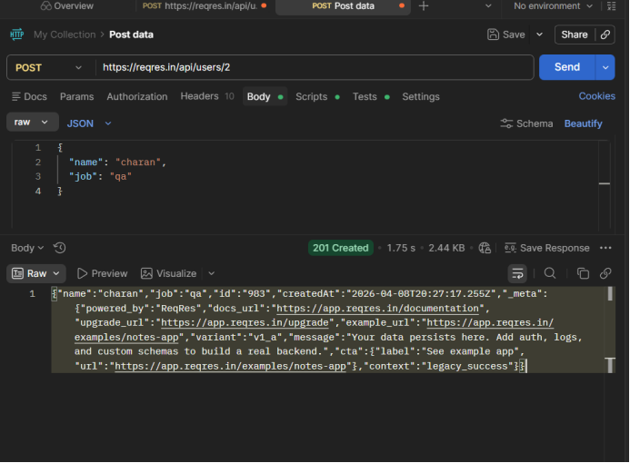
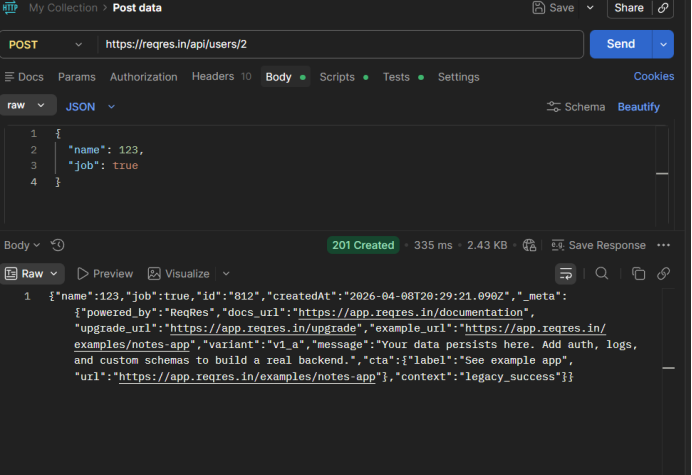

# Bug Reports

This section highlights high-level system issues identified during testing. 

The focus is on root-level problems that impact system behavior, data integrity, and reliability across services.

---

## BUG 1 — Cross-Service Data Inconsistency

**Description**  
The system does not validate relationships between services. Orders can reference users that do not exist, and the system continues to process and return successful responses.

**Observation**  
- Order Service accepts any userId without verification  
- No validation between User and Order services  
- APIs return success even when data is inconsistent  

**Impact**  
Leads to orphan records and inconsistent system state. Downstream processes may operate on incorrect data.

**Severity**  
Critical  

**Key Insight**  
The system fails silently instead of failing fast, making inconsistencies hard to detect and debug.

---

## BUG 2 — Weak Input Validation and Schema Enforcement

**Description**  
The system accepts invalid data types, missing fields, and malformed payloads during POST requests. There is no strict schema validation.

**Observation**  
- Invalid data types (number, boolean) are accepted  
- Missing required fields are not enforced  
- Incomplete responses returned after creation  

**Impact**  
Invalid and inconsistent data enters the system, affecting reliability and downstream processing.

**Severity**  
High  

**Key Insight**  
The system trusts incoming data instead of validating it, increasing the risk of data corruption.

---

## BUG 3 — Lack of Idempotency (Duplicate Data Creation)

**Description**  
Repeated POST requests with the same payload result in multiple resources being created with different IDs.

**Observation**  
- Same request creates multiple entries  
- No mechanism to prevent duplicate creation  

**Impact**  
Leads to duplicate data, affecting reporting, analytics, and consistency.

**Severity**  
High  

**Key Insight**  
The system does not ensure consistency for repeated operations, which is critical in distributed systems.

---

## BUG 4 — Silent Success with Incorrect Data

**Description**  
APIs return successful responses even when the underlying data is incorrect or inconsistent across services.

**Observation**  
- 200 OK returned despite invalid relationships  
- No validation of actual data correctness  
- System continues processing inconsistent data  

**Impact**  
Creates false confidence in system correctness and may lead to incorrect business decisions.

**Severity**  
Critical  

**Key Insight**  
Success responses do not guarantee correctness, leading to hidden system failures.

---

## Summary

The system prioritizes availability over correctness. While it appears functional, it allows invalid data, lacks validation mechanisms, and is prone to silent failures. This makes the system unreliable in real-world scenarios where data integrity is critical.