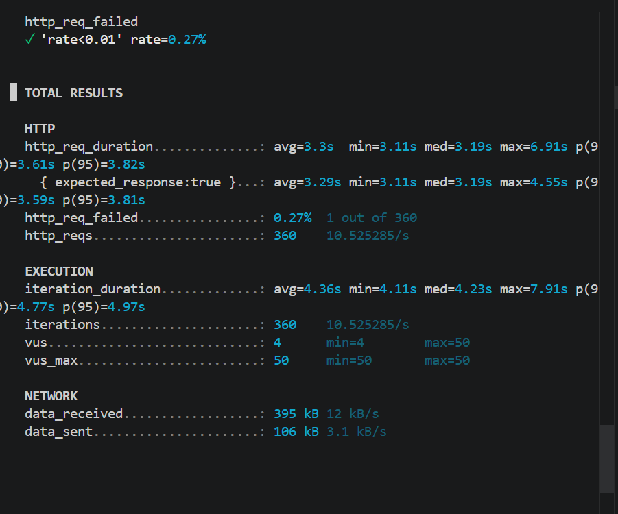

# Performance Testing

## Introduction

Performance testing was done to understand how the system behaves when multiple users access it at the same time. The focus was on response time, failure rate, and system stability under load.

---

## Tool and Setup

k6 was used for testing.

The endpoint tested was:
https://httpbin.org/delay/3

This endpoint returns a response after 3 seconds. It was used to simulate delay from an external service.

The test was run with 50 concurrent users for 30 seconds.

---

## Approach

Each user sends a request to the endpoint and waits for the response. This simulates real users waiting for data from external services.

The goal was to check how the system behaves when there is delay and multiple users access it together.

---

## Results

- Average response time was 3.27 seconds.  
- 95 percent of requests were completed within 3.64 seconds.  
- Maximum response time was 4.6 seconds.  
- Failure rate was 0 percent.  
- Throughput was around 10.5 requests per second.  

---

## Observations

Response time is close to 3 seconds as expected because of the delay.

No failures were observed, which shows the system is stable under this load.

Throughput is low because each request waits for 3 seconds before completing.

---

## Metrics

Response time shows how fast the system responds.

Failure rate shows system reliability.

Throughput shows how many requests the system can handle.

---

## Bottlenecks

The main bottleneck is the external service delay.

Requests are handled in a blocking way. Each request waits for completion.

There is no caching or optimization.

The system depends fully on external service response.

---

## Conclusion

The system works correctly under moderate load and shows stable behavior.

However, performance is limited due to external dependency and blocking requests.

The system does not scale well if latency increases.

output 

